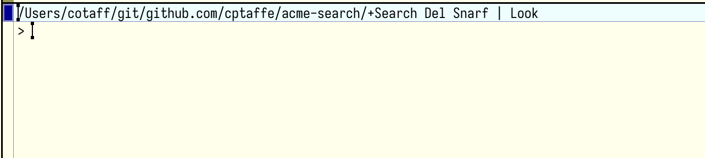
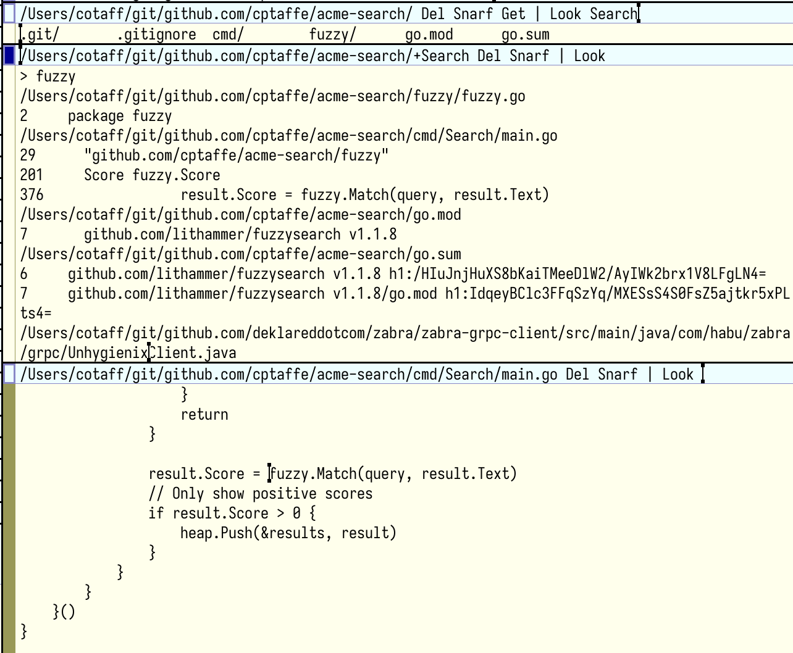

# Search

An interactive fuzzy search tool, similar to [`fzy`](https://github.com/jhawthorn/fzy). If you use Acme but would like project-wide full-text search available in IDEs like VSCode or IntelliJ, Search provides it. Simply execute `Search` from the the directory you would like to search and it will open a new `+Search` window with a prompt.



Typing within the window kicks off searches across several backends, searching:

- open windows
- files
- grep (file contents)
- language server symbols

| Backend | Flag | Default | Command |
| --- | --- | --- | --- |
| Open Windows | `+w` | yes | `9p read acme/index \| awk '{print $6}'` (equivalent) |
| Files | `+f` | no | `rg --iglob '*query*' --files .` |
| Grep | `+g` | yes | `rg query .` |
| Symbols | `+s` | yes | `L sym -p query` |

Suffixing a search query with a flag, e.g. `query+g`, scopes a search to only that backend.

For file and grep search, you will need [`ripgrep`](https://github.com/BurntSushi/ripgrep). For symbol search, you will need `acme-lsp`, with the [`L sym [-p] pattern` patch](https://github.com/9fans/acme-lsp/pull/90).

Install `Search`:

```sh
$ go install github.com/cptaffe/acme-search/cmd/Search@latest
```

In the below example, we've opened a Search window, typed in a query, and clicked with button 3 on one of the result lines. Search plumbs the address of the line we selected, and it opens in its own window.



Search uses a port of the search algorithm from `fzy`, see John Hawthorn's explanation of the [algorithm](https://github.com/jhawthorn/fzy/blob/master/ALGORITHM.md).
